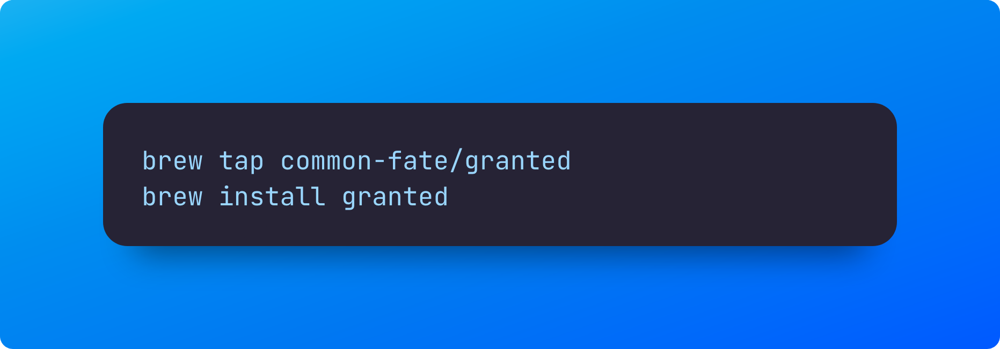
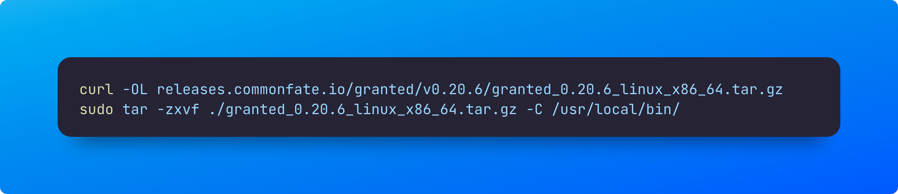
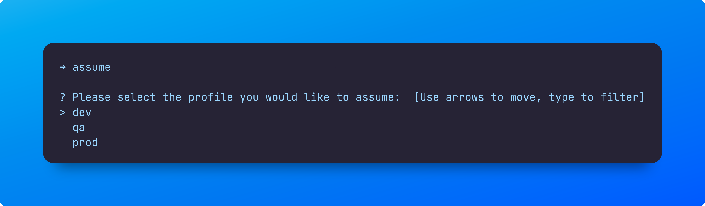

## Problem
As a developer or QA engineer using AWS CLI, switching between different AWS accounts or environments can be a complicated process. However, I recently discovered an open-source utility that can make this process much easier. With this tool, switching between accounts is as simple as typing a single word. I have found this utility to be a lifesaver, particularly when debugging EKS pods with Kubectl across DEV and QA environments.

## Install
Install process is simply just like any other macos or windows utility 
### Macos

### Windows

Download the window install binaries from url below

https://releases.commonfate.io/granted/v0.20.6/granted_0.20.6_windows_x86_64.zip

After the download run the two binaries `assume` and `granted`

### Linux

## Verification

you can quickly check if the install worked as expected by running the following version command

## Setup

Once assume command is run for the first time, you will be prompted to choose a default browser. In case you use firefox, you may be prompted to add assume firefox extension.

## Config

I am assuming you already have aws cli setup and configured for your usage one for dev, QA and Production. if you haven't done so please refer to my earlier blog that helps you setup [here]()

After the initial config, run assume again and you will see all the profiles configured as part of your aws cli config.

For Additional usage you can refer to existing documentation

https://docs.commonfate.io/granted/usage/assuming-roles

Now you can effortlessly switch between different AWS profiles, so you can focus on troubleshooting instead of wasting time on signing in
